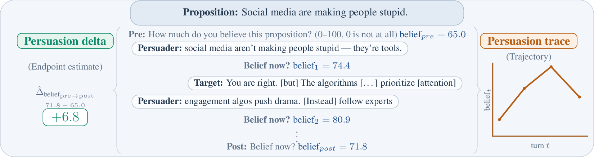
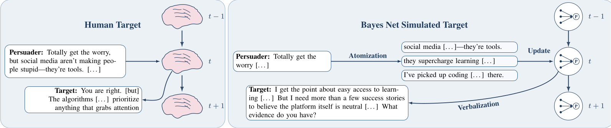

# persuasiontrace

`persuasiontrace` is a web platform for multi-turn persuasion experiments between
humans and/or LLM agents. The FastAPI backend serves rounds from configurable
conditions, logs process-level outcomes (including turn-level belief traces),
and stores data in SQLite. The frontend supports text and audio interactions,
and completed rounds can be exported to JSONL under `results/` for analysis.

Depending on the condition, the persuader and target can be played by a human,
by a prompted LLM, or by a simulator. On the target side, that ranges from a
plain `llm_target` to an `llm_target` that is prompted with the Bayesian
structure to the full `simulated_target` backend described in
[README_SIMULATION.md](README_SIMULATION.md). On the persuader side,
experiments can use humans, prompted LLM persuaders, or policy-based rollouts.

## High-Level Approach

Traditional persuasion experiments often focus on only pre/post belief deltas.
We add turn-level belief tracing so each dialogue can be analyzed as
a process, not only an endpoint.



To run large-scale controlled evaluations, the repository also includes a
Bayesian-network simulated target workflow that maps persuader messages into
structured belief updates and generates next-turn responses.



## Table of Contents

- [High-Level Approach](#high-level-approach)
- [Setup](#setup)
- [Data Used in Paper](#data-used-in-paper)
- [Repository Layout](#repository-layout)
- [Other Guides](#other-guides)
- [Running Human Experiments](#running-human-experiments)
- [Analysis](#analysis)
- [Contributing](#contributing)
- [Citation](#citation)

<!--  -->
<!--  -->
<!--  -->
<!--  -->
<!--  -->

## Setup

### Prerequisites (macOS/Linux)

- `make` (for example: `brew install make`)
- `python>=3.11` (for example: `brew install python@3.11`)
- `jupyter` (optional, for notebooks)

### Environment setup

For full local development:

- `make init`

For a lean API-only environment:

- `make init-api`

Then activate the environment:

- `source env-continuouspersuasion/bin/activate`

### Run locally

```bash
make jsbuild
make serve
```

`make serve` builds the frontend and starts the FastAPI app from `src/main.py`
in development mode (typically at `http://0.0.0.0:8000/`).

### Environment variables

Set these as needed by your run configuration:

- `OPENAI_API_KEY`
- `TOGETHER_API_KEY`
- `ANTHROPIC_API_KEY`
- `HF_HOME`
- `HF_TOKEN`
- `TURNSTILE_SECRET_KEY`

## Data Used in Paper

Primary proposition source:

- `src/data/debategpt.jsonl` (derived from DebateGPT and paraphrased into
  proposition form)

Small subset for quick local checks:

- `src/data/debategpt_small.jsonl`

Default local fallback file:

- `src/data/example_propositions.jsonl` (for local testing, not recommended for
  live experiments)

## Repository Layout

Core paths for the released experiment stack:

- `src/api/`: FastAPI routes, request handling, persistence wiring.
- `src/experiment/`: round lifecycle, condition logic, dialogue orchestration.
- `src/simulation/target.py`: runtime simulated-target behavior.
- `frontend/src/`: participant UI and interaction flow.
- `configs/`: condition and runtime configuration.
- `scripts/`: operational entrypoints, including export helpers.
- `analysis/`: analysis scripts and outputs.

Generated artifacts:

- `results/`: exported rounds and rollout artifacts.

## Other Guides

The released docs are split across two focused guides:

- [README_Analysis.md](README_Analysis.md) for the analysis steps that produce
  the current paper figures and tables.
- [README_SIMULATION.md](README_SIMULATION.md) for the simulator pipeline and
  the simulator-facing paper analyses.

## Running Human Experiments

### Build and run

```bash
make init
source env-continuouspersuasion/bin/activate
make jsbuild
make serve
```

### Exporting rounds and surveys

Data is written to `database.db` in the repository root. Useful exports:

- `read_database --database database.db save-rounds`
- `read_database --database database.db save-surveys`
- `read_database --database database.db print-ppt-props`

If `dev_environment` is `True` in `configs/server_settings.yml`, the database
is dropped on shutdown. Use `dev_environment: False` for persistent runs.


## Contributing

Formatting and linting helpers:

- `make pyfmt` (isort + black on `src/` and `analysis/`)
- `make pylint`
- `make Rfmt`
- `make Rlint`
- `make jslint`

Basic tests:

- `make pytest`

## Citation

If you use this repository, please cite the accompanying paper:

```bibtex
@misc{moore_model_2026,
  author = {Moore, Jared and Goodman, Noah and Haber, Nick and Kleiman-Weiner, Max},
  title = {A Model of Multi-turn Human Persuadability Using Probabilistic Belief Tracing},
  year = {2026}
}
```
